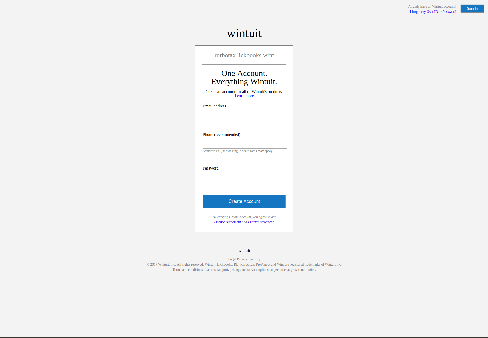

# Mint Signup Page Project

This purpose of this project was to practice creating forms in HTML/CSS by implementing the [Mint Signup Page](https://accounts.intuit.com/signup.html).

This is a project from [The Odin Project](https://www.theodinproject.com/courses/html5-and-css3/lessons/html-forms).

## Pre-Project Thoughts

No particular thoughts going in.
Mostly excited to move onto the next subsection on CSS, which I consider one of my weakest skills.

## Post-Project Thoughts

No real thoughts. I gained a slightly improved understanding of forms and their respective attributes and CSS properties.
